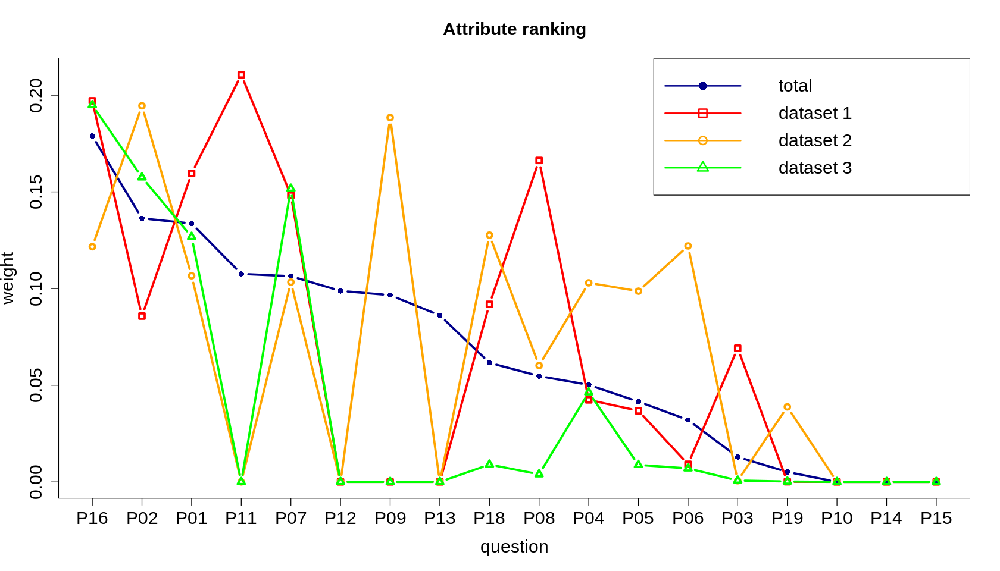
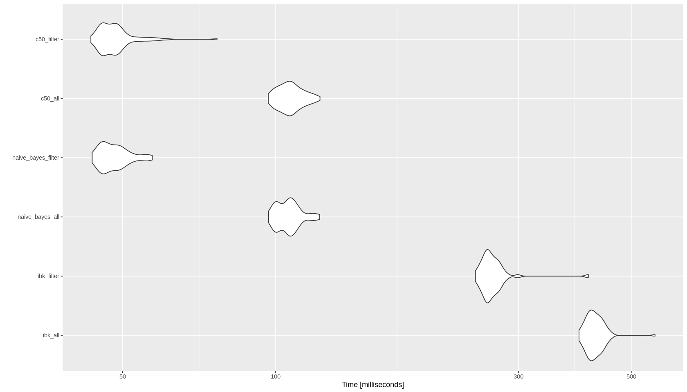

# Trabajo de minería de datos

**Asignatura: Análisis de datos e invesgitación en historia política y social**

**Alumno: Juan Luis Font Calvo**


Réplica del estudio del trabajo *“Analysis of Teacher Training in Mathematics in   Paraguay’s Elementary Education System Using Machine Learning Techniques"*.

## Introducción del problema
En esta práctica sobre minería de datos se analizará un conjuntos de datos procedentes de una encuesta realizada por el gobierno de Paraguay entre profesores de matemáticas de 216 localidades con el fin de identificar posibles necesidades con respecto a su formación, conocimientos y habilidades pedagógicas. Los detalles sobre el estudio original pueden encontrarse en el artículo *"Analysis of Teacher Training in Mathematics in Paraguay’s Elementary Education System Using Machine Learning Techniques"*, Chaves et Al. 2020.

El objetivo de la práctica es aplicar minería de datos y *machine learning* al conjunto de datos original de forma que obtengamos modelos que nos permitan determinar a partir de las respuestas al cuestionario si un docente necesita formación de refuerzo.


## Descripción de los atributos del conjunto de datos
La encuesta está compuesta por 17 preguntas (17 atributos o *features*), identificadas como P01, P02, ..., P17.

Una parte de las preguntas tienen como posibles respuesta valores numéricos (*numeric attribute*), mientras que otras toman sólo un número limitado de posibles respuestas o categorías, en forma de texto (*factor attribute*).

El siguiente listado detalla el tipo de valores asociados a cada una de las preguntas. En el caso de las preguntas con respuesta de tipo *categoría* / *factor* se detalla el dominio de posibles valores que puede tomar el atributo para cada una de las observaciones.
```
P01 {Satisfactorio,Insipiente,Ninguno}
P02 {Satisfactorio,Insipiente,Ninguno}
P03 {Mucho,Poco}
P04 {Regular,Suficiente,Insipiente}
P05 {Suficiente,Insipiente,Regular}
P06 {Suficiente,Insipiente,Regular}
P07 {Insipiente,Satisfactorio,Ninguno}
P08 {Mucho,Poco,Nada}
P09 numeric
P10 numeric
P11 numeric
P12 numeric
P13 numeric
P14 numeric
P15 numeric
P16 {Mucho,Poco}
P18 {Si,No}
P19 {Conceptual,Procedimental}
P17 {Sí,'Más o menos'}
```

### Atributo clasificador / *classifier*
La pregunta *P17*, *"¿Los alumnos docentes comprenden las diferentes estructuras que deben tener los tipos de evaluación para el mejoramiento de la tarea docente en el área de Matemática?*, es el atributo usado para clasificar las observaciones y decidir si el sujeto evaluado en la encuesta necesita o no algún tipo de refuerzo para mejorar sus habilidades. El objetivo de la práctica es entrenar diversos modelos que en función del resto de respuestas al cuestionario sean capaces de inferir la respuesta a la pregunta *P17*, evaluando con cierta fiabilidad si el docente requiere formación de refuerzo.

### Herramientas de análisis
El análisis de los datos se ha realizado en lenguaje R. El código y la documentación están contenidos en el presente [*Jupyter notebook*](https://jupyter.org), con documentación en formato Markdown.

El código desarrollado para esta práctica intenta hacer uso en la medida de lo posible de librerías nativas para R, en ciertas ocasiones la funcionalidades de la herramienta de minería de datos [Weka](https://www.cs.waikato.ac.nz/ml/weka/) no tienen un equivalente directo, por lo que se ha optado por usar la librería `RWeka` para lenguaje R proporciona *bindings* para librerías desarrolladas inicialmente en Java para Weka, como por ejemplo funciones para lectura de archivos `.arff`, o *feature selection*.

### Carga de los datos
Los datos originales usados en el artículo están divididos en 4 archivos en formato `.arff`, nativo de la herramienta Weka. La carga de datos se realiza mediante la función `read.arff` proporcionada por la librería `RWeka`.

Los archivos y conjuntos de datos usados son:
* `dataset/dataset_etapas_class17_idx1.arff`, conjunto de datos *D1*, procedente de la región Este
* `dataset/dataset_etapas_class17_idx2.arff`, conjunto de datos *D2*, procedente de la región Sur
* `dataset/dataset_etapas_class17_idx3.arff`, conjunto de datos *D3*, procedente de la región Central y Oeste
* `dataset/dataset_etapas_class17_idx.arff`, conjunto de datos *Total*, combinación de todos los conjuntos anteriores

La variable `class.attr` contiene el nombre del atributo clasificador, la pregunta *P17*.

El conjunto de datos *Total*, combinación de los subconjuntos de datos D1, D2 y D3, contiene un atributo extra, `NEtapa`. Este atributo no corresponde con ninguna de las preguntas del cuestionario y debe ser eliminado para evitar que introduzca ruido en los modelos durante el proceso de entrenamiento.


```R
library(RWeka)

# attribute for classification 
class.attr <- "P17"

# seed for the whole notebook
seed <- 3017

data.d1 <- read.arff("dataset/dataset_etapas_class17_idx1.arff");
data.d2 <- read.arff("dataset/dataset_etapas_class17_idx2.arff");
data.d3 <- read.arff("dataset/dataset_etapas_class17_idx3.arff");

# remove NEtapa attribute
data.total <- read.arff("dataset/dataset_etapas_class17_idx.arff");
data.attributes <- names(data.total)
data.attributes <- data.attributes[data.attributes != "NEtapa"]
data.total <- data.total[data.attributes]

# convenient list including all the datasets
datasets <- list(data.d1, data.d2, data.d3, "total"=data.total)
```

## Análisis de la homogeneidad


### Ranking de atributos

Este apartado recoge el cálculo estudia la correlación entre los distintos atributos de cada conjunto de datos y el atributo clasificador *P17*. Esta ordenación se realiza con la función `symmetrical.uncertainty()`, proporcionada por la librería `RWeka`.

Una vez calculado el coeficiente de ranking para cada uno de los subconjuntos D1, D2 y D3 y el conjunto *Total*, los atributos se ordenan en función a los coeficientes obtenidos para el conjunto de datos *Total* y a continuación se representan gráficamente.

Si los datos son homogéneos entre los distintos subconjuntos, es decir, las respuestas a las encuestas siguen patrones similares independientemente de la región / conjunto de datos del que proceden, es un indicio de que los datos muestran homogeneidad. En el caso de que encontremos grandes diferencias en los rankings obtenidos para cada una de las regiones, será un indicio de que los resultados no son homogéneos entre distintas regiones, cada una de ellas mostrando unos patrones de respuestas  y clasificación distintos al del resto.


```R
library(RWeka)
library(FSelector)

# list without the classification attribute / P17
data.attributes.rank <- data.attributes[data.attributes != class.attr]

# let's initialize the dataframe with the attributes to be ranked
results <- data.frame(question=data.attributes.rank)

# ranking formula
form.rank <- as.formula(paste(class.attr, "~.", sep=''))

# iteration over the 3 sub-datasets
for (i in seq(1,3)){
    # get attributes minus P17
    df <- datasets[[i]][data.attributes]
    # calculate weights
    weights <- symmetrical.uncertainty(form.rank, df)
    # add a new column for the sub-dataset
    d.name <- paste("d", i, sep='')
    results[[d.name]] <- weights$attr_importance
}
# calculate rank for dataset "total"
df <- datasets[["total"]][data.attributes]
weights <- symmetrical.uncertainty(form.rank, df)
results[["total"]] <- weights$attr_importance

# sort based on "total" column
ranking <-results[order(results$total, decreasing = TRUE),]
```


```R
print(ranking)
```

       question           d1           d2           d3       total
    16      P16 1.970815e-01 0.1216236706 0.1948705180 0.178880159
    2       P02 8.576754e-02 0.1945140291 0.1574870928 0.136294605
    1       P01 1.595718e-01 0.1066124435 0.1267708001 0.133642615
    11      P11 2.105397e-01 0.0000000000 0.0000000000 0.107572119
    7       P07 1.482383e-01 0.1033461859 0.1516790045 0.106397261
    12      P12 0.000000e+00 0.0000000000 0.0000000000 0.098787182
    9       P09 0.000000e+00 0.1884341765 0.0000000000 0.096605778
    13      P13 0.000000e+00 0.0000000000 0.0000000000 0.086124227
    17      P18 9.186946e-02 0.1276441580 0.0089874904 0.061581731
    8       P08 1.662741e-01 0.0601835270 0.0039449206 0.054744966
    4       P04 4.243235e-02 0.1029642234 0.0463433230 0.050183610
    5       P05 3.678905e-02 0.0986573025 0.0087864201 0.041516837
    6       P06 9.110573e-03 0.1220306255 0.0069867783 0.032043067
    3       P03 6.915974e-02 0.0005793417 0.0007318079 0.012895805
    18      P19 8.984024e-05 0.0388085074 0.0002060199 0.005155605
    10      P10 0.000000e+00 0.0000000000 0.0000000000 0.000000000
    14      P14 0.000000e+00 0.0000000000 0.0000000000 0.000000000
    15      P15 0.000000e+00 0.0000000000 0.0000000000 0.000000000


### Representación gráfica de la homogeneidad de datos entre los conjuntos de datos


```R
ymax <- max(apply(ranking[ , -1], 1, max, na.rm=TRUE))
ylim <- c(0, ymax)

options(repr.plot.width=14, repr.plot.height=8)

#scaling up fonts

plot(ranking$total,
    cex.lab=1.5, 
    cex.axis=1.5,
    cex.main=1.5,
    cex.sub=1.5,
    main = "Attribute ranking",
    xlab = "question",
    ylab = "weight",
    type = "b",
    pch = 16,
    lwd = 3,
    col = "darkblue",
    xaxt = "n",
    bty="L",
    ylim = ylim)

axis(1, 
     at=seq(length(ranking$question)), 
     labels=ranking$question,
     cex.axis=1.5
    )

lines(ranking$d1, type="b", pch=0, lwd=3, col="red")
lines(ranking$d2, type="b", pch=1, lwd=3, col="orange")
lines(ranking$d3, type="b", pch=2, lwd=3, col="green")

legend("topright",
       legend=c("total", "dataset 1", "dataset 2", "dataset 3"),
       col=c("darkblue", "red", "orange", "green"), 
       lty=1,
       lwd=2,
       pch=c(16, 0, 1, 2),
       cex=1.5)
```


    

    


### Conclusión sobre homogeneidad de los datos

La gráfica `Attribute ranking` del apartado anterior muestra los distintos valores de ranking obtenidos para los subconjuntos y conjunto total de datos en relación al atributo de clasificación *P17*.

El gráfico muestra que ciertas preguntas muestran una correlación homogénea con respecto a *P17* a través de todas las distintas regiones, como por ejemplo *P16*, *P10*, *P14* o *P15*.

En otros casos, preguntas como *P11*, *P09* o *P08* presentan coeficientes en el ranking muy distintos entre sí dependiendo del subconjunto de datos.

Como conclusión final, los datos sugieren que cada una de las regiones del estudio muestran distintos patrones de respuestas en relación a la pregunta *P17*, estas particularidades regionales pueden deberse  factores que están fuera de los objetivos de este estudio.

## Entrenamiento de modelos de clasificación

Estudio de la capacidad de predecir si los docentes están o no bien preparados en base a las respuestas al cuestionario. Este objetivo se puede traducir como el entrenamiento de modelos de *machine learning* de tal forma que el modelo pueda clasificar en función del atributo *P17*, "el docente está bien preparado", en base al resto de preguntas del formulario.

El estudio inicial de los datos aplicará los siguientes modelos de aprendizaje automático:
* IBk, con k=1 y usando la implementación de Java proporcionada por la herramienta Weka
* Naïve Bayes, usando la implementación proporcionada por librería R `e1071`
* C5.0, proporcionado por la librería R `c50`. Este modelo es el equivalente a [J48](https://weka.sourceforge.io/doc.dev/weka/classifiers/trees/J48.html) programado en Java por los desarrolladores de Weka, ambos implementaciones del algoritmo [C4.5](https://www.rulequest.com/see5-comparison.html).

Esta primera fase de entrenamiento de modelos se ha realizado sobre el conjunto de datos ***Total*** usando **todos los atributos contenidos en los conjuntos de datos**, a excepción de *NEtapa*, eliminado previamente del conjunto *Total*.

La estrategia de entrenamiento usada ha sido en todos los casos la de **validación cruzada**, usando 10 iteraciones (*k-folds*).

### Código para entrenar modelo IBk
Se ha usado la función `IBk` proporcionada la librería `RWeka`, una colección de *bindings* que permiten usar las funciones en Java del proyecto Weka.


```R
library(caret);
library(RWeka);

#######
# IBk #
#######

#' Train a IBk model to classify based on \code{class.attr} atribute,
#' using cross-validation.
#' 
#' @param data A data frame where each column is an attribute
#' @param kfolds Number of folds for cross-validation
#' @param class.attr Name of the classifier attribute
#' @return List with the hits and misses from each fold plus their mean and sd
#'     res$hit Vector with the percentage of successful predictions for each fold
#'     res$err Vector with the percentage of wrong predictions for each fold
#'     res$hit.mean Mean of successful predictions across folds
#'     res$hit.sd Standard deviation for successful predictions across folds     
#'     res$err.mean Mean of wrong predictions across folds
#'     res$err.sd Standard deviation for wrong predictions across folds
#'     res$cm List of confusion matrices obtained for each iteration
#' @examples
#' taining.ibk(data.total, 10, "P17")
training.ibk <- function(data, kfolds, class.attr){
    
    folds <- createFolds(data[,1], k=kfolds, list=TRUE);
    
    form <- formula(paste(class.attr, "~ ."))
    
    data.attributes <- colnames(data)
    data.attributes.learn <- data.attributes[data.attributes != class.attr]
    
    res <- list()
    res$kfolds <- kfolds
    res$class.attr <- class.attr
    res$attributes <- data.attributes.learn
    res$hit <- rep(NA, kfolds);
    res$err <- rep(NA, kfolds);
    res$cm <- list()
    
    for (i in 1:kfolds){
        # i-th set for testing
        test <- data[unlist(folds[i]), ]
        # remaining sets for training
        train <- data[unlist(folds[-i]), ]
    
        # from RWeka
        # https://cran.r-project.org/web/packages/RWeka/index.html
        model <- IBk(form, data=train)
        # prediction using model and test subset
        pred <- predict(model, newdata=test)
        # confusion matrix
        cm <- table(test[[class.attr]], pred)
        
        res$hit[i] <- sum(diag(cm))/sum(cm)
        res$err[i] <- 1 - res$hit[i]
        
        # confusion matrix
        res$cm[[i]] <- cm
    }
    
    res$hit.mean <- mean(res$hit)
    res$err.mean <- mean(res$err)
    
    res$hit.sd <- sd(res$hit)
    res$err.sd <- sd(res$err)
    
    return(res)
}
```

    Loading required package: lattice
    
    Loading required package: ggplot2
    


### Código para entrenar modelo Naïve Bayes


```R
library(e1071);
library(caret);

###############
# Naive Bayes #
###############

#' Train a Naïve Bayes model to classify based on \code{class.attr} atribute,
#' using cross-validation.
#' 
#' @param data A data frame where each column is an attribute
#' @param kfolds Number of folds for cross-validation
#' @param class.attr Name of the classifier attribute
#' @return List with the hits and misses from each fold plus their mean and sd
#'     res$hit Vector with the percentage of successful predictions for each fold
#'     res$err Vector with the percentage of wrong predictions for each fold
#'     res$hit.mean Mean of successful predictions across folds
#'     res$hit.sd Standard deviation for successful predictions across folds     
#'     res$err.mean Mean of wrong predictions across folds
#'     res$err.sd Standard deviation for wrong predictions across folds
#'     res$cm List of confusion matrices obtained for each iteration
#' @examples
#' taining.naive.bayes(data.total, 10, "P17")
training.naive.bayes <- function(data, kfolds, class.attr){
    
    folds <- createFolds(data[,1], k=kfolds, list=TRUE);
    
    form <- formula(paste(class.attr, "~ ."))
    
    data.attributes <- colnames(data)
    data.attributes.learn <- data.attributes[data.attributes != class.attr]
    
    res <- list()
    res$kfolds <- kfolds
    res$class.attr <- class.attr
    res$attributes <- data.attributes.learn
    res$hit <- rep(NA, kfolds);
    res$err <- rep(NA, kfolds);
    res$cm <- list()
    
    for (i in 1:kfolds){
        # i-th set for testing
        test <- data[unlist(folds[i]), ]
        # remaining sets for training
        train <- data[unlist(folds[-i]), ]

        model <- naiveBayes(form, train)
        pred <- predict(model, newdata=test) 
        cm <- table(test[[class.attr]], pred) 
        
        res$hit[i] <- sum(diag(cm))/sum(cm)
        res$err[i] <- 1 - res$hit[i]
        
        # confusion matrix
        res$cm[[i]] <- cm
    }
    
    res$hit.mean <- mean(res$hit)
    res$err.mean <- mean(res$err)
    
    res$hit.sd <- sd(res$hit)
    res$err.sd <- sd(res$err)

    return(res)
}
```

### Código para entrenar modelo J48 / C5.0

`J48` es la implementación en Java del algoritmo *C4.5*. La librería de R `C50` proporciona una implementación equivalente a `J48`.

La función `C5.0` tiene problemas con caracteres de texto especiales (i.e. vocales acentuadas) y espacios en blanco en los valores de tipo *factor*.


```R
library(C50)
library(caret);

########################
# C5.0 ~ J48 from Weka #
########################

#' Train a C5.0 model to classify based on \code{class.attr} atribute,
#' using cross-validation. C5.0 is the closes to the J48 Java-based
#' implementation provided by Weka project.
#' 
#' @param data A data frame where each column is an attribute
#' @param kfolds Number of folds for cross-validation
#' @param class.attr Name of the classifier attribute
#' @return List with the hits and misses from each fold plus their mean and sd
#'     res$hit Vector with the percentage of successful predictions for each fold
#'     res$err Vector with the percentage of wrong predictions for each fold
#'     res$hit.mean Mean of successful predictions across folds
#'     res$hit.sd Standard deviation for successful predictions across folds     
#'     res$err.mean Mean of wrong predictions across folds
#'     res$err.sd Standard deviation for wrong predictions across folds
#'     res$cm List of confusion matrices obtained for each iteration
#' @examples
#' taining.c50(data.total, 10, "P17")
training.c50 <- function(data, kfolds, class.attr){
    
    folds <- createFolds(data[,1], k=kfolds, list=TRUE);
        
    data.attributes <- colnames(data)
    data.attributes.learn <- data.attributes[data.attributes != class.attr]
    
    res <- list()
    res$kfolds <- kfolds
    res$class.attr <- class.attr
    res$attributes <- data.attributes.learn
    res$hit <- rep(NA, kfolds);
    res$err <- rep(NA, kfolds);
    res$cm <- list()

    
    for (i in 1:kfolds){
        # i-th set for testing
        test <- data[unlist(folds[i]), ]
        # remaining sets for training
        train <- data[unlist(folds[-i]), ]

        # we need to remove class attr. / P17 from training set
        train.c50 <- train[data.attributes.learn]
    
        # get class. attribute column / P17
        # empty spaces and accents ARE a problem
        train.class <- sapply(train[[class.attr]], gsub, pattern="Sí", replacement="si")
        train.class <- sapply(train.class, gsub, pattern="Más o menos", replacement="mas_o_menos")
        # we need factor outcome for the model
        train.class <- as.factor(train.class)
    
        # test class. attribute needs same pre-processing
        test.class <- sapply(test[[class.attr]], gsub, pattern="Sí", replacement="si")
        test.class <- sapply(test.class, gsub, pattern="Más o menos", replacement="mas_o_menos")
        # we need factor outcome for the model
        test.class <- as.factor(test.class)
    
        model <- C5.0(train.c50, train.class, rules=TRUE)
        pred <- predict(model, newdata=test)
        cm <- table(test.class, pred)
        
        res$hit[i] <- sum(diag(cm))/sum(cm)
        res$err[i] <- 1 - res$hit[i]
        
        # confusion matrix
        res$cm[[i]] <- cm
    }
    
    res$hit.mean <- mean(res$hit)
    res$err.mean <- mean(res$err)
    
    res$hit.sd <- sd(res$hit)
    res$err.sd <- sd(res$err)
    
    return(res)
}
```

## Precisión de los modelos entrenados con todos los atributos

### Predicción con IBk, todos los atributos
El código incluye la función auxiliar `show.results` que facilita la presentación de los datos obtenidos para cada uno de los procesos de entrenamiento.


```R
set.seed(seed)
kfolds <- 10
ibk.all <- training.ibk(data.total, kfolds, "P17")

#' Generate a string with a summary of the results 
#' generated by the \code{training.*} functions above.
#'
#' @param alg String with the model used, e.g. IBk
#' @param attr String with attributes used for training
#' @param kfolds Number of folds used in cross-validation
#' @param res List with results generated by \code{training.*} functions
#' @return Multi-line string with result summary
#'
#' @examples
#' show.results('IBk, 'all attributes, 10, ibk.total)
show.results <- function(alg, attr, kfolds, res){
    lines <- list()
    lines[[01]] <- "================================"
    lines[[02]] <- sprintf("Algorithm    : %s", alg)
    lines[[03]] <- sprintf("Dataset      : %s", attr)
    lines[[04]] <- sprintf("K-folds      : %d", kfolds)
    lines[[05]] <- sprintf("Avg (sd) acc : %.3f (%.3f) %%", 100*res$hit.mean, 100*res$hit.sd)
    lines[[06]] <- sprintf("Avg (sd) err : %.3f (%.3f) %%", 100*res$err.mean, 100*res$err.sd)
    lines[[07]] <- "================================\n"

    msg <- paste(lines, collapse = "\n")
    return(msg)
}

# cat properly processes \n
cat(show.results("IBk (k=1)", "all attributes", kfolds, ibk.all))
```

    ================================
    Algorithm    : IBk (k=1)
    Dataset      : all attributes
    K-folds      : 10
    Avg (sd) acc : 63.948 (9.256) %
    Avg (sd) err : 36.052 (9.256) %
    ================================


### Predicción con Naïve Bayes, todos los atributos


```R
set.seed(seed)
kfolds <- 10
nb.all <- training.naive.bayes(data.total, kfolds, "P17")

cat(show.results("Naïve Bayes", "all attributes", kfolds, nb.all))
```

    ================================
    Algorithm    : Naïve Bayes
    Dataset      : all attributes
    K-folds      : 10
    Avg (sd) acc : 70.028 (7.345) %
    Avg (sd) err : 29.972 (7.345) %
    ================================


### Predicción con C5.0, todos los atributos


```R
set.seed(seed)
kfolds <- 10
c50.all <- training.c50(data.total, kfolds, "P17")

cat(show.results("C5.0", "all attributes", kfolds, c50.all))
```

    ================================
    Algorithm    : C5.0
    Dataset      : all attributes
    K-folds      : 10
    Avg (sd) acc : 67.130 (8.951) %
    Avg (sd) err : 32.870 (8.951) %
    ================================


### Conclusión sobre precisión de los modelos entrenados con todos los atributos
El modelo que ha dado mejores resultados durante el proceso de validación cruzada usando todos los atributos del conjunto de datos *Total* ha sido **Naïve Bayes**, con un porcentaje de acierto del 70%, con *C5.0* acercándose en porcentaje de aciertos. Además *Naïve Bayes* es el método con menor desviación típica, lo que se traduce que su tasa de acierto es más consistente a través de las distintas iteraciones de la validación cruzada.

El motivo por el que sólo se alcanzan tasas de acierto como máximo del 70% puede deberse a la inclusión de atributos en el proceso de entrenamiento que introducen ruído en los resultados. En el estudio de la homogeneidad hemos comprobado que ciertas preguntas del cuestionario siguen pautas muy distintas dependiendo de la región de la que procedan, además de tener atributos que no son nada significativos en relación al atributo clasificador.

Queda pendiente un análisis más detallado del desempeño de cada uno de los algoritmos para tratar y del propio conjunto de datos *Total* para intentar identificar paradojas que pueden aparecer en los procesos de aprendizaje automático (e.g. *The Simpson's Paradox*, *Accuracy Paradox* entre otras).

## Selección de atributos

La selección de los atributos más prometedores de cara a los modelos de clasificación (*feature selection*) se ha realizado usando la herramienta [Weka](https://www.cs.waikato.ac.nz/ml/weka/) y el paquete `fastCorrBasedFS`. El motivo ha sido la imposibilidad de encontrar un paquete equivalente para lenguaje R.

Filtrado de atributos se ha realizado sobre el conjunto de datos *Total* usando los siguiente parámetros en Weka:
* attribute evaluator: `SymmetricalUncertAttributeSetEval`
* search method: `FCBFSearch`

El resultado ha sido el siguiente:
```
=== Attribute Selection on all input data ===

Search Method:
	Attribute ranking.


     J || SU(j,Class) ||    I || SU(i,j). 
    16 ;    0.1788802 ;     *
     2 ;    0.1362946 ;     *
     1 ;    0.1336426 ;     2 ; 0.23226795599503008
    11 ;    0.1075721 ;     *
     7 ;    0.1063973 ;     2 ; 0.21037867835309815
    12 ;    0.0987872 ;    11 ; 0.3460006112293995
     9 ;    0.0966058 ;    11 ; 0.4175147034035191
    13 ;    0.0861242 ;    11 ; 0.3326517569987719
    15 ;    0.0730455 ;    11 ; 0.2835782921797696
    17 ;    0.0615817 ;     *
     8 ;    0.054745  ;     *
    14 ;    0.0505423 ;    11 ; 0.16635597639517383
     4 ;    0.0501836 ;    16 ; 0.07575072439001745
    10 ;    0.0499124 ;    11 ; 0.22435910766142814
     5 ;    0.0415168 ;    16 ; 0.08194073158116684
     6 ;    0.0320431 ;    16 ; 0.05367776683839208
     3 ;    0.0128958 ;    16 ; 0.024175761956890085
    18 ;    0.0051556 ;    16 ; 0.008505687958635275

Attribute Evaluator (supervised, Class (nominal): 19 P17):
	Symmetrical Uncertainty Ranking Filter

Ranked attributes:
 0.1789  16 P16
 0.1363   2 P02
 0.1076  11 P11
 0.0616  17 P18
 0.0547   8 P08

Selected attributes: 16,2,11,17,8 : 5
```

Los atributos más prometedores de cara al entrenamiento de modelos de clasificación son **P16, P02, P11, P18 y P08**. 

### Precisión de los modelos entrenados con subconjunto de atributos
El siguiente código muestra por pantalla un resumen de los resultados obtenidos con los modelos IBk, Naïve Bayes y C5.0 entrenados con todos los atributos y con un subconjunto de ellos resultantes del proceso de *feature selection*.


```R
kfolds <- 10
set.seed(seed)

# attributes selected by Weka using fastCorrBasedFS package
data.attributes.filter = c("P02", "P08", "P11", "P16", "P17", "P18")
attribute.names <- paste(data.attributes.filter, collapse=', ')
# keep only the attributes from feature selection
data.total.filter <- data.total[data.attributes.filter]


ibk.filter <- training.ibk(data.total.filter, kfolds, "P17")

cat(show.results("IBk (k=1)", "all attributes", kfolds, ibk.all))
cat(show.results("IBk (k=1)", attribute.names, kfolds, ibk.filter))

cat("\n\n")

nb.filter <- training.naive.bayes(data.total.filter, kfolds, "P17")
cat(show.results("Naïve Bayes", "all attributes", kfolds, nb.all))
cat(show.results("Naïve Bayes", attribute.names, kfolds, nb.filter))

cat("\n\n")

c50.filter <- training.c50(data.total.filter, kfolds, "P17")
cat(show.results("C5.0", "all attributes", kfolds, c50.all))
cat(show.results("C5.0", attribute.names, kfolds, c50.filter))
```

    ================================
    Algorithm    : IBk (k=1)
    Dataset      : all attributes
    K-folds      : 10
    Avg (sd) acc : 63.948 (9.256) %
    Avg (sd) err : 36.052 (9.256) %
    ================================
    ================================
    Algorithm    : IBk (k=1)
    Dataset      : P02, P08, P11, P16, P17, P18
    K-folds      : 10
    Avg (sd) acc : 73.636 (8.246) %
    Avg (sd) err : 26.364 (8.246) %
    ================================
    
    
    ================================
    Algorithm    : Naïve Bayes
    Dataset      : all attributes
    K-folds      : 10
    Avg (sd) acc : 70.028 (7.345) %
    Avg (sd) err : 29.972 (7.345) %
    ================================
    ================================
    Algorithm    : Naïve Bayes
    Dataset      : P02, P08, P11, P16, P17, P18
    K-folds      : 10
    Avg (sd) acc : 75.411 (7.656) %
    Avg (sd) err : 24.589 (7.656) %
    ================================
    
    
    ================================
    Algorithm    : C5.0
    Dataset      : all attributes
    K-folds      : 10
    Avg (sd) acc : 67.130 (8.951) %
    Avg (sd) err : 32.870 (8.951) %
    ================================
    ================================
    Algorithm    : C5.0
    Dataset      : P02, P08, P11, P16, P17, P18
    K-folds      : 10
    Avg (sd) acc : 76.334 (8.882) %
    Avg (sd) err : 23.666 (8.882) %
    ================================


### Conclusión sobre precisión de los modelos entrenados con un subconjunto de atributos
Se puede apreciar que la precisión de todos los modelos mejora cuando el entrenamiento se realiza únicamente con el subconjunto de atributos P02, P08, P11, P16, y P18.

En esta segunda etapa de entrenamiento el modelo C5.0 proporciona los mejores resultados de clasificación, alcanzando el 76%.

El motivo de esta mejora al reducir el número de atributos involucrados en el proceso de entrenamiento usando técnicas de *feature selection* se debe a que parte de los atributos del conjunto de datos no aportan ninguna información significativa de cara a la clasificación de los datos en relación al clasificador *P17*. Eliminar estos atributos poco significativos reduce el ruido en el proceso de entrenamiento y permite obtener modelos más precisos.


# Estudio del rendimiento
El siguiente apartado hace un breve análisis del rendimiento de los distintos modelos en cada una de las situaciones de entrenamiento: usando todos los atributos y sólo un subconjunto seleccionado mediante *feature selection*.

Las pruebas de rendimiento hacen uso de la librería R `microbenchmark`. El número de veces que cada función se ejecuta es controlado por la variable `iterations`.

Los resultados adjuntos se han obtenido en una máquina con las siguientes características:
* CPU Intel i5-4690 CPU, 3.50GHz
* 8 GB RAM
* R 4.0.3
* Docker 20.10
* Debian "Bullseye" para arquitectura x86_64 / amd64


```R
library(microbenchmark)

iterations <- 100
set.seed(seed)

mb <- microbenchmark(
    "ibk_all" = {
        training.ibk(data.total, kfolds, "P17")
    },
    "ibk_filter" = {
        training.ibk(data.total.filter, kfolds, "P17")
    },
    "naive_bayes_all" = {
        training.naive.bayes(data.total, kfolds, "P17")
    },
    "naive_bayes_filter" = {
        training.naive.bayes(data.total.filter, kfolds, "P17")
    },
    "c50_all" = {
        training.naive.bayes(data.total, kfolds, "P17")
    },
    "c50_filter" = {
        training.naive.bayes(data.total.filter, kfolds, "P17")
    },
    times = iterations
)
```


```R
# ploting betchmark results
library(ggplot2);
autoplot(mb);
```

    Coordinate system already present. Adding new coordinate system, which will replace the existing one.
    


    

    


### Conclusiones de las pruebas de rendimiento

Observando la gráfica del apartado anterior, donde se muestra un resumen de los tiempos de ejecución de cada uno de los entrenamientos, se aprecia que el proceso de entrenamiento fue más rápido para todos los modelos (IBk, Naïve Bayes y C5.0) cuando se usó un subconjunto de atributos especialmente elegido mediante *feature selection*.

El rendimiento de los modelos Naïve Bayes y C5.0 es similar en términos de tiempos de ejecución, situándose el tiempo de ejecución en torno a los 100 ms para el entrenamiento con todos los atributos y por debajo de los 50 ms para el entrenamiento con un subconjunto de los mismos.

Por otro lado IBk parece ser varias veces más lento que los anteriores, con tiempos de ejecución en torno a los 475 ms para todos los atributos y alrededor de 275 ms para un subconjunto de atributos.

Las diferencias de tiempo de ejecución entre usar todos los atributos y un subconjunto de los mismos para un mismo modelo es obvia ya que el uso de menos atributos conlleva directamente la realización de un menor número de operaciones.

Esta diferencia entre el rendimiento de los distintos modelos puede deberse a que tanto las implementaciones de Naïve Bayes y C5.0 usadas en esta práctica son librerías nativas en lenguaje R, que posiblemente usan código optimizado en C, mientras que la implementación de IBk está escrita originalmente en Java por el proyecto Weka y no cuenta con el grado de optimización de las librerías R.

## Conclusiones

Las conclusiones derivadas de estea práctica son las siguientes:
* hay varias preguntas que muestran unas pautas de respuesta homogéneas a través de las distintas regiones en las que se han recogido, por contra los patrones de algunas respuestas dependen fuertemente de la región en las que fueron recogidas.
* el uso de modelos de machine learning con validación cruzada y usando todos los atributos del conjunto de datos total consigue en el mejor de los casos una tasa de aciertos del 70% (Naïve Bayes)
* las herramientas de *feature selection* identifican un conjunto de 5 preguntas que son las que más información aportan sobre el clasificador *P17*
* el entrenamiento de modelos usando únicamente los 5 atributos elegidos mediante *feature selection* mejoran la precisión de todos los modelos, haciendo que *C5.0* alcance un porcentaje de acierto del 76%
* con respecto al rendimiento en términos de tiempo de ejecución, la reducción del número de atributos involucrados en el proceso de entrenamiento se traduce en todos los casos estudiados e una reducción de los tiempos de ejecución. También se observa que el rendimiento del código nativo para R (con posibles optimizaciones en C) tiene un rendimiento claramente superior a los implementados en Java (IBk)

## Enlaces

[Repositorio con código de la práctica](https://bitbucket.org/juanlufont/machine-learning)

Obtener una copia del respositorio:

Git:
```
git clone git@bitbucket.org:juanlufont/machine-learning.git
```

HTTPS:
```
git clone https://juanlufont@bitbucket.org/juanlufont/machine-learning.git
```
